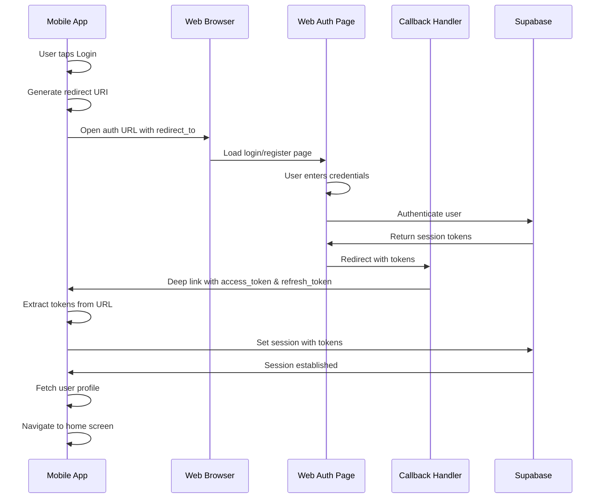

# Design Document

## Overview

This design implements a secure OAuth authentication flow between the JejakAthlete mobile app (React Native/Expo) and web app (Next.js). The flow allows users to authenticate via the web interface and automatically return to the mobile app with valid session credentials. The implementation leverages Supabase authentication, Expo's WebBrowser API, and deep linking capabilities.

## Architecture

### High-Level Flow

```
Mobile App → Web Browser (Auth) → Web Callback → Mobile App (with tokens)
```

### Component Interaction



## Components and Interfaces

### 1. Mobile App Components

#### AuthScreen Component
- **Location**: `packages/jejakathlete-mobile/src/components/auth/AuthScreen.tsx`
- **Responsibilities**:
  - Display login/signup buttons
  - Generate redirect URI using `makeRedirectUri`
  - Open web authentication in secure browser
  - Handle browser result and extract tokens
- **Key Methods**:
  - `handleLogin()`: Opens web login with redirect parameter
  - `handleSignUp()`: Opens web registration with redirect parameter

#### AuthContext
- **Location**: `packages/jejakathlete-mobile/src/contexts/AuthContext.tsx`
- **Responsibilities**:
  - Manage authentication state
  - Handle deep link callbacks
  - Extract and validate tokens from URLs
  - Establish Supabase session
  - Fetch user profile after authentication
- **Key Methods**:
  - `setSessionFromUrl(url: string)`: Parse URL and set session
  - Deep link listener setup in useEffect

### 2. Web App Components

#### Login Page
- **Location**: `packages/jejakathlete-web/src/app/auth/login/page.tsx`
- **Responsibilities**:
  - Display login form
  - Accept `redirect_to` query parameter
  - Authenticate user with Supabase
  - Redirect to mobile or web success page
- **Current Implementation**: Already handles `redirect_to` parameter

#### Register Page
- **Location**: `packages/jejakathlete-web/src/app/auth/register/page.tsx`
- **Responsibilities**:
  - Display registration form
  - Accept `redirect_to` query parameter
  - Create user account with Supabase
  - Redirect to mobile or web success page
- **Current Implementation**: Already handles `redirect_to` parameter

#### Callback Handler
- **Location**: `packages/jejakathlete-web/src/app/auth/callback/page.tsx`
- **Responsibilities**:
  - Exchange authorization code for session
  - Handle OAuth provider callbacks
  - Redirect to mobile app with tokens
  - Handle errors gracefully
- **Current Implementation**: Already implemented with mobile redirect support

### 3. Configuration Components

#### app.json (Mobile)
- **Location**: `packages/jejakathlete-mobile/app.json`
- **Configuration**:
  - Custom URL scheme: `jejakathlete`
  - iOS universal links: `jejak-athlete.vercel.app`
  - Android intent filters for deep links
- **Current Status**: Already configured

#### Deep Link Configuration
- **iOS**: Associated domains configured
- **Android**: Intent filters with autoVerify enabled
- **Scheme**: `jejakathlete://auth/callback`
- **Universal Link**: `https://jejak-athlete.vercel.app/auth/callback`

## Data Models

### Redirect URI Format
```typescript
// Mobile redirect URI
const redirectUri = "jejakathlete://auth/callback";
// or
const redirectUri = "https://jejak-athlete.vercel.app/auth/callback";
```

### Success Callback URL Format
```typescript
interface SuccessCallbackParams {
  access_token: string;
  refresh_token: string;
  expires_in?: number;
}

// Example URL
"jejakathlete://auth/callback?access_token=xxx&refresh_token=yyy&expires_in=3600"
```

### Error Callback URL Format
```typescript
interface ErrorCallbackParams {
  error: string;
  error_description?: string;
}

// Example URL
"jejakathlete://auth/callback?error=invalid_grant&error_description=Invalid+credentials"
```

### Web Auth URL Format
```typescript
interface WebAuthParams {
  redirect_to: string; // URL-encoded mobile redirect URI
}

// Example URLs
"https://jejak-athlete.vercel.app/auth/login?redirect_to=jejakathlete%3A%2F%2Fauth%2Fcallback"
"https://jejak-athlete.vercel.app/auth/register?redirect_to=jejakathlete%3A%2F%2Fauth%2Fcallback"
```

## Correctness Properties

*A property is a characteristic or behavior that should hold true across all valid executions of a system-essentially, a formal statement about what the system should do. Properties serve as the bridge between human-readable specifications and machine-verifiable correctness guarantees.*

### Property 1: Redirect URI preservation
*For any* authentication flow initiated from mobile, the redirect_to parameter should be preserved through the entire web authentication process and used in the final redirect
**Validates: Requirements 1.2, 3.1**

### Property 2: Token extraction completeness
*For any* successful authentication callback URL, if access_token is present then refresh_token must also be present
**Validates: Requirements 1.4**

### Property 3: Session establishment success
*For any* valid token pair (access_token, refresh_token), calling setSession should result in an authenticated session state
**Validates: Requirements 1.5**

### Property 4: Error propagation
*For any* authentication error on the web, the error information should be included in the mobile redirect URL
**Validates: Requirements 2.1, 2.2**

### Property 5: Deep link handling
*For any* deep link containing authentication tokens, the mobile app should process the tokens regardless of whether the app was running or closed
**Validates: Requirements 4.4, 4.5**

### Property 6: URL encoding correctness
*For any* redirect URL with special characters, the URL should be properly encoded when passed as redirect_to parameter
**Validates: Requirements 3.5**

## Error Handling

### Mobile App Error Scenarios

1. **Browser Cancelled**
   - User closes browser before completing auth
   - Result type: `'cancel'`
   - Action: Return to auth screen silently (no error message)

2. **Network Timeout**
   - Browser fails to load or times out
   - Action: Display "Network error, please try again"

3. **Invalid Tokens in Callback**
   - Malformed or missing tokens in URL
   - Action: Log error, display "Authentication failed"

4. **Session Establishment Failure**
   - Supabase rejects tokens
   - Action: Display "Session expired, please login again"

### Web App Error Scenarios

1. **Code Exchange Failure**
   - Invalid or expired authorization code
   - Action: Redirect to mobile with error parameter

2. **Missing redirect_to Parameter**
   - No mobile redirect specified
   - Action: Redirect to web success page (normal web flow)

3. **OAuth Provider Error**
   - Google/other provider returns error
   - Action: Redirect to mobile with error details

### Error Response Format

```typescript
interface AuthError {
  error: string;           // Error code
  error_description?: string; // Human-readable description
}

// Mobile app should display user-friendly messages:
const errorMessages: Record<string, string> = {
  'invalid_grant': 'Invalid credentials. Please try again.',
  'invalid_request': 'Authentication request failed. Please try again.',
  'access_denied': 'Access was denied. Please try again.',
  'network_error': 'Network error. Please check your connection.',
  'session_expired': 'Session expired. Please login again.',
};
```

## Testing Strategy

### Unit Tests

1. **URL Parsing Tests**
   - Test extraction of access_token and refresh_token from URLs
   - Test handling of malformed URLs
   - Test URL encoding/decoding of redirect_to parameter

2. **Redirect URI Generation Tests**
   - Test makeRedirectUri generates correct format
   - Test URI includes correct scheme and path

3. **Error Handling Tests**
   - Test error parameter extraction from callback URLs
   - Test error message mapping

### Integration Tests

1. **End-to-End Auth Flow**
   - Test complete flow from mobile → web → mobile
   - Verify session is established after callback
   - Verify user profile is loaded

2. **Deep Link Handling**
   - Test app handles deep links when running
   - Test app handles deep links when closed
   - Test app handles deep links when backgrounded

3. **Error Scenarios**
   - Test browser cancellation handling
   - Test network error handling
   - Test invalid token handling

### Manual Testing Checklist

- [ ] iOS: Test custom scheme deep link (jejakathlete://)
- [ ] iOS: Test universal link (https://jejak-athlete.vercel.app)
- [ ] Android: Test custom scheme deep link
- [ ] Android: Test HTTPS intent filter
- [ ] Test login flow from mobile
- [ ] Test registration flow from mobile
- [ ] Test error handling (wrong credentials)
- [ ] Test browser cancellation
- [ ] Test app closed → deep link opens app
- [ ] Test app running → deep link switches to app

## Security Considerations

### Token Transmission
- Tokens are passed via URL parameters (standard OAuth practice)
- Use HTTPS for universal links to prevent interception
- Tokens are short-lived (Supabase default: 1 hour)
- Refresh tokens allow session renewal

### Deep Link Security
- Custom scheme (jejakathlete://) can be claimed by malicious apps on Android
- Universal links (https://) are more secure as they require domain verification
- Always validate token format before using
- Never log full tokens (only log presence/absence)

### Session Management
- Tokens stored in SecureStore (encrypted on device)
- Session auto-refreshes before expiration
- Logout clears all stored tokens

## Implementation Notes

### Current State Analysis

**Already Implemented:**
1. ✅ Mobile AuthScreen with WebBrowser integration
2. ✅ Web login/register pages with redirect_to support
3. ✅ Web callback handler with mobile redirect
4. ✅ Deep link configuration in app.json
5. ✅ AuthContext with setSessionFromUrl method
6. ✅ Deep link listener in AuthContext

**Needs Enhancement:**
1. ⚠️ Error handling in mobile app (currently logs but doesn't display to user)
2. ⚠️ Loading states during token exchange
3. ⚠️ Comprehensive logging for debugging
4. ⚠️ User feedback for different error scenarios

### Recommended Improvements

1. **Add Toast/Alert for Errors**
   - Display user-friendly error messages
   - Use existing ToastContext if available

2. **Enhanced Logging**
   - Log redirect URI generation
   - Log callback URL reception
   - Log token extraction success/failure
   - Log session establishment result

3. **Loading States**
   - Show loading indicator while processing callback
   - Prevent multiple authentication attempts

4. **Token Validation**
   - Validate token format before calling setSession
   - Check for required parameters (access_token, refresh_token)

5. **Retry Mechanism**
   - Allow user to retry after authentication failure
   - Clear error state on retry

## Platform-Specific Considerations

### iOS
- Universal links require apple-app-site-association file on web server
- Associated domains must be configured in app.json
- Deep links work immediately without verification

### Android
- Intent filters require autoVerify for universal links
- May need to verify domain ownership in Google Search Console
- Custom scheme works without verification
- Some Android versions may show app chooser dialog

### Testing on Simulators/Emulators
- iOS Simulator: Use `xcrun simctl openurl booted <url>` to test deep links
- Android Emulator: Use `adb shell am start -W -a android.intent.action.VIEW -d <url>` to test deep links
