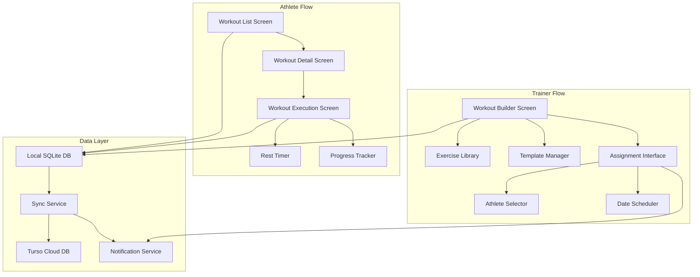

# Design Document

## Overview

The workout creation and distribution system enables trainers to build simple workout programs and assign them to athletes through an intuitive mobile interface. This is an MVP (Minimum Viable Product) focused on core functionality with a clear path for future enhancements. The system follows the existing offline-first architecture pattern used throughout the Jejak Atlet app, ensuring workouts are accessible even without internet connectivity.

### Key Design Principles

1. **Offline-First Architecture**: All workout data is stored locally first, then synchronized to the cloud when connectivity is available
2. **Simplicity First**: MVP focuses on essential features - create workout, add exercises, assign to athletes, track completion
3. **Template-Based Efficiency**: Trainers can save and reuse workout templates to reduce repetitive work
4. **Mobile-Optimized UI**: Responsive design adapts to different screen sizes (small phones, tablets)
5. **Future-Ready**: Architecture supports future enhancements (notifications, advanced tracking, supersets) without major refactoring

### MVP Scope

**Included in MVP:**
- Basic workout creation (name, description, exercises)
- Simple exercise library with search and muscle group filtering
- Exercise configuration (sets, reps, rest time only)
- Workout assignment to athletes with scheduling
- Athlete workout viewing and execution
- Basic rest timer
- Progress tracking (completion status)
- Offline support with sync
- Template management

**Future Enhancements (Not in MVP):**
- Push notifications
- Difficulty levels and estimated duration
- Weight/duration/distance tracking
- Superset and circuit grouping
- Custom exercise creation
- Audio/haptic feedback
- Workout editing after assignment
- Advanced analytics and insights

## Architecture

### System Components



### Data Flow

1. **Workout Creation Flow**:
   - Trainer creates workout → Saves to local DB → Marks as dirty → Background sync to cloud
   - Template saved → Stored in trainer's personal library → Available for future use

2. **Workout Assignment Flow**:
   - Trainer assigns workout → Creates assignment records → Triggers notification → Syncs to cloud
   - Athlete receives notification → Fetches workout data → Stores locally → Available offline

3. **Workout Execution Flow**:
   - Athlete starts workout → Updates local status → Tracks progress → Marks complete → Syncs to cloud
   - Trainer views progress → Fetches from local DB (synced data) → Displays completion status

### Technology Stack

- **Frontend**: React Native (Expo)
- **UI Components**: Custom components following existing patterns (Button, Card, Input, Dropdown)
- **Local Database**: SQLite (expo-sqlite)
- **Cloud Database**: Turso (libSQL)
- **Notifications**: Expo Notifications
- **State Management**: React Context + useState/useEffect
- **Styling**: NativeWind (Tailwind CSS for React Native)

## Components and Interfaces

### Database Schema

#### New Tables

```sql
-- Workout templates created by trainers (MVP - simplified)
CREATE TABLE workout_templates (
    id INTEGER PRIMARY KEY AUTOINCREMENT,
    trainer_id INTEGER NOT NULL,
    name TEXT NOT NULL,
    description TEXT,
    -- Future: difficulty_level, estimated_duration
    created_at DATETIME DEFAULT CURRENT_TIMESTAMP,
    updated_at DATETIME DEFAULT CURRENT_TIMESTAMP,
    synced_at DATETIME,
    is_dirty BOOLEAN DEFAULT FALSE,
    FOREIGN KEY (trainer_id) REFERENCES users (id) ON DELETE CASCADE
);

-- Exercise library (MVP - system exercises only)
CREATE TABLE exercises (
    id INTEGER PRIMARY KEY AUTOINCREMENT,
    name TEXT NOT NULL,
    muscle_group TEXT NOT NULL, -- e.g., 'chest', 'legs', 'back', 'shoulders', 'arms', 'core'
    -- Future: description, equipment, video_url, image_url, is_custom, created_by_trainer_id
    created_at DATETIME DEFAULT CURRENT_TIMESTAMP,
    updated_at DATETIME DEFAULT CURRENT_TIMESTAMP,
    synced_at DATETIME,
    is_dirty BOOLEAN DEFAULT FALSE
);

-- Exercises within a workout template (MVP - simplified)
CREATE TABLE workout_exercises (
    id INTEGER PRIMARY KEY AUTOINCREMENT,
    workout_template_id INTEGER NOT NULL,
    exercise_id INTEGER NOT NULL,
    order_index INTEGER NOT NULL, -- Position in workout
    sets INTEGER NOT NULL,
    reps INTEGER NOT NULL,
    rest_time INTEGER NOT NULL, -- in seconds
    -- Future: duration, distance, weight, notes, group_id, group_type
    created_at DATETIME DEFAULT CURRENT_TIMESTAMP,
    updated_at DATETIME DEFAULT CURRENT_TIMESTAMP,
    synced_at DATETIME,
    is_dirty BOOLEAN DEFAULT FALSE,
    FOREIGN KEY (workout_template_id) REFERENCES workout_templates (id) ON DELETE CASCADE,
    FOREIGN KEY (exercise_id) REFERENCES exercises (id) ON DELETE CASCADE
);

-- Workout assignments to athletes
CREATE TABLE workout_assignments (
    id INTEGER PRIMARY KEY AUTOINCREMENT,
    workout_template_id INTEGER NOT NULL,
    athlete_id INTEGER NOT NULL,
    trainer_id INTEGER NOT NULL,
    scheduled_date DATE NOT NULL,
    status TEXT DEFAULT 'pending' CHECK (status IN ('pending', 'in_progress', 'completed', 'skipped', 'cancelled')),
    started_at DATETIME,
    completed_at DATETIME,
    created_at DATETIME DEFAULT CURRENT_TIMESTAMP,
    updated_at DATETIME DEFAULT CURRENT_TIMESTAMP,
    synced_at DATETIME,
    is_dirty BOOLEAN DEFAULT FALSE,
    FOREIGN KEY (workout_template_id) REFERENCES workout_templates (id) ON DELETE CASCADE,
    FOREIGN KEY (athlete_id) REFERENCES users (id) ON DELETE CASCADE,
    FOREIGN KEY (trainer_id) REFERENCES users (id) ON DELETE CASCADE
);

-- Athlete's progress through a workout session (MVP - simplified)
CREATE TABLE workout_session_progress (
    id INTEGER PRIMARY KEY AUTOINCREMENT,
    workout_assignment_id INTEGER NOT NULL,
    workout_exercise_id INTEGER NOT NULL,
    set_number INTEGER NOT NULL,
    completed BOOLEAN DEFAULT FALSE,
    -- Future: actual_reps, actual_weight, actual_duration, notes
    completed_at DATETIME,
    created_at DATETIME DEFAULT CURRENT_TIMESTAMP,
    updated_at DATETIME DEFAULT CURRENT_TIMESTAMP,
    synced_at DATETIME,
    is_dirty BOOLEAN DEFAULT FALSE,
    FOREIGN KEY (workout_assignment_id) REFERENCES workout_assignments (id) ON DELETE CASCADE,
    FOREIGN KEY (workout_exercise_id) REFERENCES workout_exercises (id) ON DELETE CASCADE
);

-- Indexes for performance
CREATE INDEX idx_workout_templates_trainer ON workout_templates (trainer_id);
CREATE INDEX idx_exercises_muscle_group ON exercises (muscle_group);
CREATE INDEX idx_workout_exercises_template ON workout_exercises (workout_template_id);
CREATE INDEX idx_workout_exercises_order ON workout_exercises (workout_template_id, order_index);
CREATE INDEX idx_workout_assignments_athlete ON workout_assignments (athlete_id);
CREATE INDEX idx_workout_assignments_trainer ON workout_assignments (trainer_id);
CREATE INDEX idx_workout_assignments_status ON workout_assignments (status);
CREATE INDEX idx_workout_assignments_date ON workout_assignments (scheduled_date);
CREATE INDEX idx_workout_session_progress_assignment ON workout_session_progress (workout_assignment_id);
```

### UI Components

#### 1. WorkoutBuilderScreen (Trainer)

**Purpose**: Main interface for creating and editing workouts

**Key Features** (MVP):
- Simple workout form (name, description)
- Exercise list display
- Add exercise button → Opens exercise library modal
- Save as template button
- Assign to athletes button

**Future Enhancements**:
- Drag-to-reorder functionality
- Difficulty and duration fields
- Group exercises for supersets/circuits

**Component Structure**:
```typescript
interface WorkoutBuilderScreenProps {
  templateId?: number; // For editing existing template
  onBack: () => void;
}

// State management
const [workoutName, setWorkoutName] = useState('');
const [description, setDescription] = useState('');
const [difficulty, setDifficulty] = useState<'beginner' | 'intermediate' | 'advanced'>('beginner');
const [estimatedDuration, setEstimatedDuration] = useState(30);
const [exercises, setExercises] = useState<WorkoutExercise[]>([]);
const [showExerciseLibrary, setShowExerciseLibrary] = useState(false);
const [showAssignmentModal, setShowAssignmentModal] = useState(false);
```

**Layout**:
- Header: Title, back button, save button
- Metadata section: Collapsible card with workout details
- Exercise list: Scrollable list with reorder handles
- Floating action button: Add exercise
- Bottom actions: Save as template, Assign to athletes

#### 2. ExerciseLibraryModal (Trainer)

**Purpose**: Browse and select exercises from library

**Key Features** (MVP):
- Search bar with real-time filtering
- Muscle group tabs (All, Chest, Legs, Back, Shoulders, Arms, Core)
- Simple exercise cards with name and muscle group
- Single-select mode for adding exercises

**Future Enhancements**:
- Equipment filter chips
- Create custom exercise button
- Multi-select mode
- Exercise images and videos

**Component Structure**:
```typescript
interface ExerciseLibraryModalProps {
  visible: boolean;
  onClose: () => void;
  onSelectExercises: (exercises: Exercise[]) => void;
  trainerId: number;
}

// State management
const [searchQuery, setSearchQuery] = useState('');
const [selectedCategory, setSelectedCategory] = useState('all');
const [selectedEquipment, setSelectedEquipment] = useState<string[]>([]);
const [exercises, setExercises] = useState<Exercise[]>([]);
const [selectedExercises, setSelectedExercises] = useState<Exercise[]>([]);
```

#### 3. ExerciseConfigModal (Trainer)

**Purpose**: Configure sets, reps, rest time for an exercise

**Key Features** (MVP):
- Sets input (number picker, 1-10)
- Reps input (number picker, 1-100)
- Rest time input (seconds, 0-300)

**Future Enhancements**:
- Weight input
- Duration for time-based exercises
- Distance for cardio exercises
- Notes textarea
- Exercise type toggle

**Component Structure**:
```typescript
interface ExerciseConfigModalProps {
  visible: boolean;
  exercise: Exercise;
  initialConfig?: WorkoutExerciseConfig;
  onSave: (config: WorkoutExerciseConfig) => void;
  onClose: () => void;
}

interface WorkoutExerciseConfig {
  sets: number;
  reps?: number;
  duration?: number; // seconds
  distance?: number; // meters
  weight?: number; // kg
  restTime: number; // seconds
  notes?: string;
}
```

#### 4. WorkoutAssignmentModal (Trainer)

**Purpose**: Assign workout to athletes with scheduling

**Key Features**:
- Athlete list with checkboxes (enrolled athletes only)
- Select all / deselect all
- Date picker for scheduling
- Optional notes for assignment
- Assign button

**Component Structure**:
```typescript
interface WorkoutAssignmentModalProps {
  visible: boolean;
  workoutTemplate: WorkoutTemplate;
  trainerId: number;
  onClose: () => void;
  onAssign: (athleteIds: number[], scheduledDate: string, notes?: string) => void;
}

// State management
const [athletes, setAthletes] = useState<Athlete[]>([]);
const [selectedAthleteIds, setSelectedAthleteIds] = useState<number[]>([]);
const [scheduledDate, setScheduledDate] = useState(new Date());
const [assignmentNotes, setAssignmentNotes] = useState('');
```

#### 5. WorkoutListScreen (Athlete)

**Purpose**: Display all assigned workouts

**Key Features**:
- Tab navigation (Upcoming, Completed, All)
- Workout cards with name, date, status, completion indicator
- Pull-to-refresh
- Filter by date range
- Empty state for no workouts

**Component Structure**:
```typescript
interface WorkoutListScreenProps {
  athleteId: number;
}

// State management
const [activeTab, setActiveTab] = useState<'upcoming' | 'completed' | 'all'>('upcoming');
const [workouts, setWorkouts] = useState<WorkoutAssignment[]>([]);
const [isLoading, setIsLoading] = useState(true);
const [isRefreshing, setIsRefreshing] = useState(false);
```

**Layout**:
- Header: Title, filter button
- Tab bar: Upcoming / Completed / All
- Workout list: Scrollable cards
- Floating sync indicator (when offline)

#### 6. WorkoutDetailScreen (Athlete)

**Purpose**: View workout details before starting

**Key Features**:
- Workout metadata (name, description, duration, difficulty)
- Exercise list with sets/reps/rest time
- Visual grouping for supersets/circuits
- Trainer notes
- Start workout button
- Mark as skipped button (with confirmation)

**Component Structure**:
```typescript
interface WorkoutDetailScreenProps {
  workoutAssignmentId: number;
  onBack: () => void;
  onStartWorkout: () => void;
}

// State management
const [workout, setWorkout] = useState<WorkoutAssignmentDetail | null>(null);
const [exercises, setExercises] = useState<WorkoutExerciseDetail[]>([]);
const [isLoading, setIsLoading] = useState(true);
```

#### 7. WorkoutExecutionScreen (Athlete)

**Purpose**: Guide athlete through workout with timers

**Key Features**:
- Current exercise display (large, prominent)
- Set counter (1/3, 2/3, etc.)
- Rest timer with countdown
- Check button to complete set
- Skip exercise button
- Previous/Next exercise navigation
- Progress bar at top
- Finish workout button (when all complete)

**Component Structure**:
```typescript
interface WorkoutExecutionScreenProps {
  workoutAssignmentId: number;
  onBack: () => void;
  onComplete: () => void;
}

// State management
const [currentExerciseIndex, setCurrentExerciseIndex] = useState(0);
const [currentSet, setCurrentSet] = useState(1);
const [isResting, setIsResting] = useState(false);
const [restTimeRemaining, setRestTimeRemaining] = useState(0);
const [progress, setProgress] = useState<WorkoutProgress>({});
const [exercises, setExercises] = useState<WorkoutExerciseDetail[]>([]);
```

**Layout**:
- Header: Progress bar, exit button
- Exercise card: Name, muscle group, current set indicator
- Set details: Target reps/weight/duration
- Action area: Large check button or rest timer
- Navigation: Previous/Next buttons
- Bottom: Skip exercise, finish workout buttons

#### 8. WorkoutProgressDashboard (Trainer)

**Purpose**: Monitor athlete workout completion

**Key Features**:
- Athlete list with completion percentages
- Filter by date range
- Workout assignment list per athlete
- Completion status indicators (pending, completed, overdue, skipped)
- Tap to view workout details

**Component Structure**:
```typescript
interface WorkoutProgressDashboardProps {
  trainerId: number;
}

// State management
const [athletes, setAthletes] = useState<AthleteProgress[]>([]);
const [selectedAthleteId, setSelectedAthleteId] = useState<number | null>(null);
const [dateRange, setDateRange] = useState({ start: Date, end: Date });
const [isLoading, setIsLoading] = useState(true);
```

## Data Models

### TypeScript Interfaces

```typescript
// Core workout types
interface WorkoutTemplate {
  id: number;
  trainer_id: number;
  name: string;
  description?: string;
  difficulty_level: 'beginner' | 'intermediate' | 'advanced';
  estimated_duration: number; // minutes
  created_at: string;
  updated_at: string;
}

interface Exercise {
  id: number;
  name: string;
  description?: string;
  muscle_group: string;
  equipment: string;
  video_url?: string;
  image_url?: string;
  is_custom: boolean;
  created_by_trainer_id?: number;
}

interface WorkoutExercise {
  id: number;
  workout_template_id: number;
  exercise_id: number;
  order_index: number;
  sets?: number;
  reps?: number;
  duration?: number; // seconds
  distance?: number; // meters
  weight?: number; // kg
  rest_time: number; // seconds
  notes?: string;
  group_id?: number;
  group_type: 'single' | 'superset' | 'circuit';
  exercise?: Exercise; // Joined data
}

interface WorkoutAssignment {
  id: number;
  workout_template_id: number;
  athlete_id: number;
  trainer_id: number;
  scheduled_date: string;
  status: 'pending' | 'in_progress' | 'completed' | 'skipped' | 'cancelled';
  started_at?: string;
  completed_at?: string;
  notes?: string;
  workout_template?: WorkoutTemplate; // Joined data
}

interface WorkoutSessionProgress {
  id: number;
  workout_assignment_id: number;
  workout_exercise_id: number;
  set_number: number;
  completed: boolean;
  actual_reps?: number;
  actual_weight?: number;
  actual_duration?: number;
  notes?: string;
  completed_at?: string;
}

// Extended types for UI
interface WorkoutAssignmentDetail extends WorkoutAssignment {
  exercises: WorkoutExerciseDetail[];
  trainer_name: string;
}

interface WorkoutExerciseDetail extends WorkoutExercise {
  exercise: Exercise;
  progress: WorkoutSessionProgress[];
}

interface AthleteProgress {
  athlete_id: number;
  athlete_name: string;
  total_assigned: number;
  completed: number;
  completion_rate: number;
  recent_assignments: WorkoutAssignment[];
}
```

## Error Handling

### Validation Rules

1. **Workout Creation**:
   - Workout name: Required, 3-100 characters
   - At least 1 exercise required
   - Sets: 1-10 range
   - Reps: 1-100 range
   - Rest time: 0-600 seconds (10 minutes max)
   - Duration: 1-7200 seconds (2 hours max)

2. **Exercise Creation**:
   - Exercise name: Required, 3-100 characters
   - Muscle group: Required, from predefined list
   - Equipment: Required, from predefined list

3. **Workout Assignment**:
   - At least 1 athlete selected
   - Scheduled date: Cannot be in the past
   - Workout template: Must exist and belong to trainer

### Error Messages

```typescript
const ERROR_MESSAGES = {
  WORKOUT_NAME_REQUIRED: 'Workout name is required',
  WORKOUT_NAME_TOO_SHORT: 'Workout name must be at least 3 characters',
  NO_EXERCISES: 'Add at least one exercise to the workout',
  NO_ATHLETES_SELECTED: 'Select at least one athlete',
  INVALID_DATE: 'Scheduled date cannot be in the past',
  NETWORK_ERROR: 'Unable to sync. Changes saved locally.',
  SAVE_ERROR: 'Failed to save workout. Please try again.',
  LOAD_ERROR: 'Failed to load workout data.',
  DELETE_ERROR: 'Failed to delete workout.',
};
```

### Offline Handling

- All create/update operations save to local DB first
- Display sync status indicator when offline
- Queue operations for background sync
- Show toast notifications for sync success/failure
- Graceful degradation: disable cloud-dependent features when offline

## Testing Strategy

### Unit Tests

1. **Data Layer Tests**:
   - Workout CRUD operations
   - Exercise library queries
   - Assignment creation and updates
   - Progress tracking calculations
   - Sync conflict resolution

2. **Validation Tests**:
   - Input validation for all forms
   - Date validation
   - Exercise configuration validation
   - Assignment validation

3. **Utility Tests**:
   - Rest timer logic
   - Progress calculation
   - Completion status determination
   - Date formatting

### Integration Tests

1. **Workout Creation Flow**:
   - Create workout → Add exercises → Save template → Verify DB
   - Create workout → Assign to athletes → Verify notifications
   - Edit existing template → Verify changes persist

2. **Workout Execution Flow**:
   - Start workout → Complete sets → Finish workout → Verify completion
   - Start workout → Skip exercise → Finish workout → Verify status
   - Start workout offline → Complete → Sync when online → Verify sync

3. **Sync Tests**:
   - Create workout offline → Go online → Verify sync
   - Modify workout offline → Sync → Verify cloud update
   - Conflict resolution: Same workout modified on different devices

### UI/UX Tests

1. **Responsive Design**:
   - Test on small screens (< 380px width)
   - Test on tablets (> 600px width)
   - Verify touch targets are adequate (min 44x44)
   - Test landscape orientation

2. **Accessibility**:
   - Screen reader compatibility
   - Sufficient color contrast
   - Keyboard navigation (if applicable)
   - Clear focus indicators

3. **Performance**:
   - Large workout lists (100+ workouts)
   - Exercise library with 500+ exercises
   - Smooth scrolling and animations
   - Rest timer accuracy

### Manual Testing Scenarios

1. **Trainer Workflow**:
   - Create a workout with 5 exercises
   - Group 2 exercises as a superset
   - Save as template
   - Assign to 3 athletes with different dates
   - Verify athletes receive notifications
   - Monitor completion status

2. **Athlete Workflow**:
   - Receive workout assignment notification
   - View workout details
   - Start workout
   - Complete all sets with rest timers
   - Finish workout
   - Verify completion syncs to trainer

3. **Offline Scenario**:
   - Disable network
   - Create workout as trainer
   - Assign to athletes
   - Enable network
   - Verify sync completes
   - Check athlete receives assignment

4. **Edge Cases**:
   - Delete workout template with active assignments
   - Cancel assignment after athlete starts
   - Modify workout while athlete is executing
   - Multiple trainers assigning to same athlete
   - Athlete completes workout late (past scheduled date)

## Performance Considerations

### Database Optimization

- Use indexes on frequently queried columns (trainer_id, athlete_id, scheduled_date)
- Limit query results with pagination (20-50 items per page)
- Use JOIN queries to reduce round trips
- Cache exercise library in memory after first load

### UI Optimization

- Virtualized lists for large datasets (FlatList with windowSize)
- Lazy load exercise images
- Debounce search input (300ms delay)
- Memoize expensive calculations (React.memo, useMemo)
- Optimize re-renders with useCallback

### Sync Optimization

- Batch sync operations (sync all dirty records at once)
- Implement exponential backoff for failed syncs
- Prioritize user-initiated syncs over background syncs
- Use delta sync (only sync changed records)

### Memory Management

- Clear timer intervals on component unmount
- Unsubscribe from event listeners
- Limit cached data size
- Use pagination for large lists

## Security Considerations

### Data Access Control

- Trainers can only view/edit their own workouts
- Athletes can only view workouts assigned to them
- Validate trainer-athlete relationship before assignment
- Prevent unauthorized workout modifications

### Input Sanitization

- Sanitize all text inputs to prevent injection
- Validate numeric inputs are within acceptable ranges
- Escape special characters in notes/descriptions
- Limit file upload sizes for exercise images

### API Security

- Use authenticated requests for all operations
- Implement rate limiting on workout creation
- Validate user permissions on server side
- Use HTTPS for all network requests

## Future Enhancements

### Phase 2 Features

1. **Workout Analytics**:
   - Volume tracking (total weight lifted)
   - Workout frequency charts
   - Personal records within workouts
   - Progress photos

2. **Advanced Programming**:
   - Periodization support (mesocycles, microcycles)
   - Progressive overload automation
   - Deload weeks
   - Exercise substitutions

3. **Social Features**:
   - Share workout templates with other trainers
   - Public workout library
   - Athlete feedback/comments on workouts
   - Workout ratings

4. **Media Integration**:
   - Exercise video demonstrations
   - Form check video uploads
   - Audio cues during workout
   - Music integration

5. **Wearable Integration**:
   - Apple Watch workout tracking
   - Heart rate monitoring
   - Calorie burn estimation
   - Auto-detect exercise completion

### Technical Debt

- Migrate to React Query for better cache management
- Implement proper error boundaries
- Add comprehensive logging
- Set up automated testing pipeline
- Optimize bundle size
