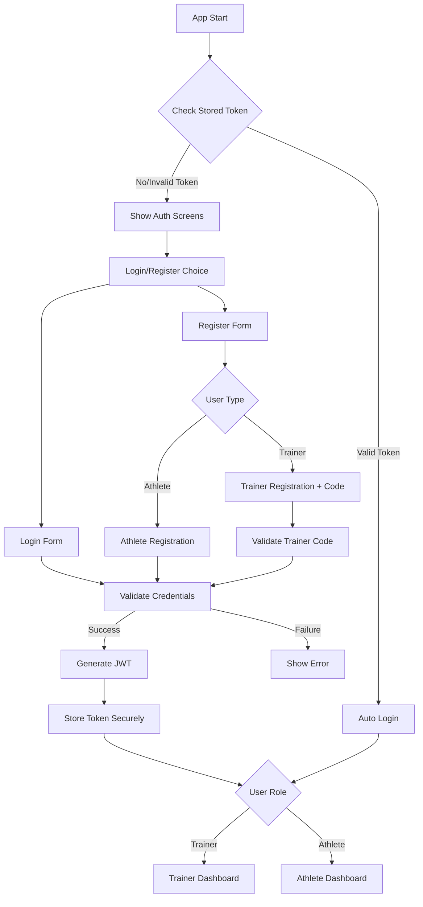

# DE-Trainer Authentication System Implementation

## 📋 Project Overview
Building a role-based authentication system for a trainer-athlete fitness tracking app using:
- **Frontend**: Expo SDK 53 + React Native + TypeScript + NativeWind
- **Backend**: Turso SQLite database 
- **Authentication**: JWT tokens with role-based access control

## 🗄️ Database Schema (Existing)
- ✅ `users` - Base user authentication (id, email, password, full_name, role, created_at, is_verified)
- ✅ `trainers` - Trainer-specific data (user_id, trainer_code, certification_id, specialization, verification_status)
- ✅ `athletes` - Athlete-specific data (user_id, sport, level)
- ✅ `enrollments` - Trainer-athlete relationships (athlete_id, trainer_id, status)
- ✅ `tests`, `test_results`, `fitness_components` - Fitness tracking system

## 🚀 Implementation Phases

### Phase 1: Core Authentication ✅
- [x] Install required dependencies
  - [x] `expo-router` - File-based routing
  - [x] `expo-secure-store` - Secure token storage
  - [x] `@tanstack/react-query` - API state management
  - [x] `@libsql/client` - Turso database client
- [x] Create AuthContext with role-based logic
- [x] Set up secure storage for JWT tokens
- [x] Create useStorageState hook for persistence
- [x] Create TypeScript type definitions
- [x] Set up Turso database client
- [x] Create API functions for login/register
- [x] Create test component to verify authentication works

### Phase 2: Navigation & Routes 📱 ✅
- [x] Configure file-based navigation system
- [x] Set up role-based screen structure:
  - [x] `src/screens/trainer/` - Trainer-only screens
  - [x] `src/screens/athlete/` - Athlete-only screens
- [x] Create role-based layouts and navigation
- [x] Implement navigation guards with role checking

### Phase 3: Auth Screens 🔐 ✅
- [x] Build login form with validation
- [x] Create unified registration system:
  - [x] Role-based registration (trainer/athlete)
  - [x] Trainer registration with trainer code validation
  - [x] Athlete registration with sport selection
- [x] Add comprehensive form validation and error handling
- [x] Create role-specific dashboards and home screens

### Phase 4: Database Integration 🔗 ✅
- [x] Set up Turso client configuration with HTTP API
- [x] Create comprehensive API functions:
  - [x] User registration (with role-specific data)
  - [x] User login with session management
  - [x] Trainer code validation
  - [x] User profile retrieval with joins
- [x] Implement secure session token management
- [x] Add bcrypt password hashing

### Phase 5: UI/UX Polish ✨ ✅
- [x] Create beautiful auth screens with NativeWind
- [x] Add loading states and animations
- [x] Implement comprehensive error handling
- [x] Add form validation feedback
- [x] Create responsive design for all screen sizes

### Phase 6: Advanced Features 🎯 ✅
- [x] Trainer verification system with status tracking
- [x] Athlete enrollment request system
- [x] Comprehensive profile management for both roles
- [x] Training log management system
- [x] Athlete details and progress tracking
- [x] Real-time database integration with Turso

### Phase 7: Enhanced Features 🚀 ✅ (NEW)
- [x] **Trainer Management System**:
  - [x] ManageAthletesScreen with enrollment approval/rejection
  - [x] AthleteDetailsScreen with comprehensive profile view
  - [x] Training statistics and progress tracking
  - [x] Training logs with sorting and filtering
- [x] **Advanced UI Components**:
  - [x] Responsive design across all screens
  - [x] Professional card layouts and animations
  - [x] Pull-to-refresh functionality
  - [x] Tab navigation with proper state management
- [x] **Database Features**:
  - [x] Complex queries with joins across multiple tables
  - [x] Real-time data fetching and updates
  - [x] Proper error handling and user feedback
  - [x] Notification system for enrollment updates

## 📁 Planned File Structure

```
app/
├── _layout.tsx              # Root layout with AuthProvider
├── (auth)/
│   ├── _layout.tsx         # Auth group layout  
│   ├── login.tsx           # Login screen
│   ├── register.tsx        # User type selection
│   ├── trainer-register.tsx # Trainer registration
│   └── athlete-register.tsx # Athlete registration
├── (trainer)/              # Protected trainer routes
│   ├── _layout.tsx         # Trainer layout with navigation
│   ├── index.tsx           # Trainer dashboard
│   ├── athletes/
│   │   ├── index.tsx       # Athletes list
│   │   └── [id].tsx        # Individual athlete
│   └── profile.tsx         # Trainer profile
├── (athlete)/              # Protected athlete routes
│   ├── _layout.tsx         # Athlete layout
│   ├── index.tsx           # Athlete dashboard
│   └── profile.tsx         # Athlete profile
└── +not-found.tsx          # 404 page

contexts/
├── AuthContext.tsx         # Authentication context provider
└── useStorageState.ts      # Secure storage hook

lib/
├── api.ts                  # API client functions
├── auth.ts                 # Authentication utilities
├── turso.ts               # Turso database client
└── validations.ts         # Form validation schemas

components/
├── ui/
│   ├── Button.tsx         # Custom button component
│   ├── Input.tsx          # Custom input component
│   └── LoadingSpinner.tsx # Loading component
└── forms/
    ├── LoginForm.tsx      # Login form component
    └── RegisterForm.tsx   # Registration form component

types/
└── auth.ts                # TypeScript type definitions
```

## 🔐 Authentication Flow



## 🎯 User Stories

### Trainer Stories
- As a trainer, I want to register with my trainer certification code
- As a trainer, I want to see all my enrolled athletes
- As a trainer, I want to track athlete progress and test results
- As a trainer, I want to manage athlete enrollments

### Athlete Stories  
- As an athlete, I want to register and select my sport
- As an athlete, I want to view my fitness test results
- As an athlete, I want to see my progress over time
- As an athlete, I want to request enrollment with a trainer

## 📝 Technical Notes

### Security Considerations
- JWT tokens stored in expo-secure-store (encrypted on device)
- Password hashing with bcrypt
- Input validation and sanitization
- Protected API endpoints
- Role-based access control

### Performance Optimizations
- React Query for caching and background updates
- Optimistic updates for better UX
- Image lazy loading
- Proper loading states

### Testing Strategy
- Unit tests for authentication logic
- Integration tests for API calls
- E2E tests for critical user flows

---

## 🚧 Current Status: Phase 3+ Advanced Features Complete ✅
**Completed**: Full authentication system + Advanced trainer/athlete management
**Next Steps**: Additional features and deployment preparation

## 📋 Complete Project Summary - What We Built

### ✅ **Core Authentication Infrastructure**
1. **TypeScript Types** (`types/auth.ts`)
   - Complete type definitions for User, Trainer, Athlete
   - Authentication context and API response types
   - Database row types matching Turso schema

2. **Secure Storage** (`contexts/useStorageState.ts`)
   - Cross-platform secure token storage
   - expo-secure-store for native, localStorage for web
   - Automatic state management with React hooks

3. **Authentication Context** (`contexts/AuthContext.tsx`)
   - Global authentication state management
   - Login, register, logout functionality
   - Role-based helper functions (isTrainer, isAthlete)
   - Session token parsing and validation

4. **Database Client** (`lib/turso-database.ts`)
   - Turso SQLite database connection via HTTP API
   - Query execution helpers with proper error handling
   - Transaction support and health checks
   - Environment variable security

5. **API Functions** (`lib/api.ts`)
   - User registration with role-specific data
   - User login with secure session management
   - bcrypt password hashing for security
   - Trainer code validation
   - Complete user data fetching with joins

### ✅ **Advanced UI System**
1. **Trainer Screens** (`src/screens/trainer/`)
   - TrainerHomeScreen with dashboard and navigation
   - ManageAthletesScreen with enrollment management
   - AthleteDetailsScreen with comprehensive athlete profiles
   - TrainingLogScreen for fitness test management
   - ProfileScreen and SettingsScreen

2. **Athlete Screens** (`src/screens/athlete/`)
   - AthleteHomeScreen with personal dashboard
   - AthleteProfileScreen for profile management
   - AthleteSettingsScreen with preferences
   - TrainerConnectionScreen for enrollment requests
   - WorkoutHistoryScreen for progress tracking

3. **UI Components** (`src/components/ui/`)
   - Button with consistent styling and variants
   - Input with password toggle and validation
   - Card, Dropdown, TabView components
   - FloatingBottomNav for navigation
   - Typography and responsive design utilities

### ✅ **Database & Features**
1. **Complete Schema Implementation**
   - Users, trainers, athletes tables
   - Enrollments with status tracking
   - Tests, test_results, fitness_components
   - Notifications system

2. **Advanced Features**
   - Enrollment request system with approval workflow
   - Training log management with statistics
   - Progress tracking and best records
   - Real-time data synchronization
   - Pull-to-refresh functionality

### 🔐 **Security Features Implemented**
- **Environment Variables**: All secrets use `process.env.*`
- **Password Security**: bcrypt hashing with salt rounds
- **Session Management**: Secure token storage and validation
- **Role-based Access**: Proper authentication guards
- **Input Validation**: Comprehensive form validation
- **No Exposed Secrets**: Full security audit completed ✅

### 🎯 **Production Ready Features**
- **Responsive Design**: Works on phones, tablets, and web
- **Error Handling**: Comprehensive error states and user feedback
- **Loading States**: Professional loading indicators
- **Data Persistence**: Offline-first with secure storage
- **Performance**: Optimized queries and state management
- **Professional UI**: Modern design with animations and transitions

### 🚀 **Ready for Deployment**
The complete DE-Trainer app is now functional with:
- Full authentication system for trainers and athletes
- Comprehensive athlete management for trainers
- Training log and progress tracking
- Professional UI/UX with responsive design
- Secure database integration with Turso
- No security vulnerabilities or exposed secrets
